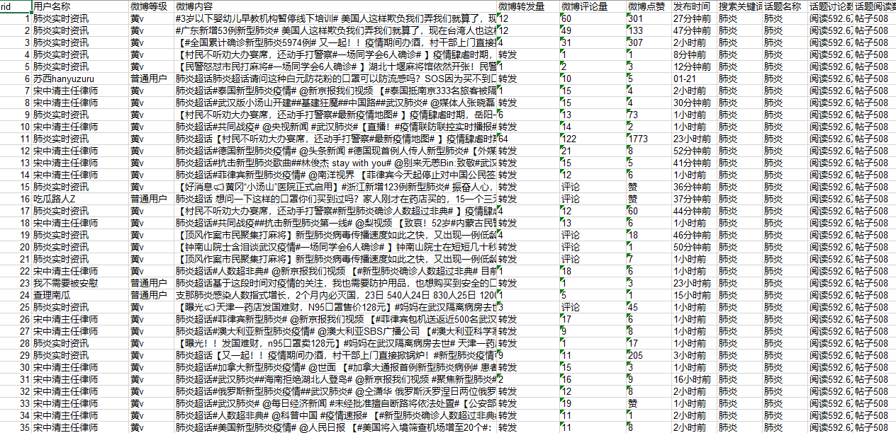

# weibo-topic-spyder
微博超级话题爬虫，微博词频统计+情感分析+简单分类

新增微博普通话题爬取，其中讨论和阅读数量的爬取待完善

爬取数据展示

### 使用方法
爬虫主文件：

微博普通话题：normal-topic-spyder.py

微博超级话题：super-topic-spyder.py

在爬虫主文件中的主函数中输入账号、密码和想要爬取的超话名称即可开始爬取，需要提前安装所需的python库和chromedriver驱动

爬取结束后数据会自动保存在当前目录下的excel文件中，每行为一个微博数据。

提示：普通的话题爬取需要添加#，例如#话题#，超级话题无需添加；一般而言，在微博中超级话题前带有钻石标志，普通话题为#话题#的格式

### 超级话题爬虫

使用了selenium模拟浏览器登陆进行爬取，具体话题爬取数量受微博限制，目前单个话题最大获取微博数量为8000条左右，选择了使用手机网页模式爬取，以获得最佳的爬取效果。

账号与IP数量对单个超话的爬取帮助不大，就只设置了单账号和ip模式，若需多超话同时爬取可以自行添加。

如需爬取多个超话，可以选择使用cookie登陆，最为方便

### 词频统计
使用了jieba库进行分词，最后对分词结果进行简单统计并且存储到txt中

### 情感分析 
调用了百度大脑的api接口，可以自行注册获取key，平台不限调用次数，详细接口见[百度大脑](https://ai.baidu.com/tech/nlp_apply/sentiment_classify) 

### 其他
欢迎大家参与和完善：如有其他问题，欢迎提交issue
