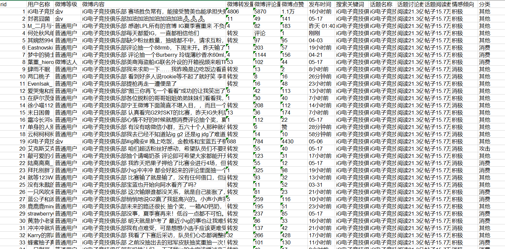
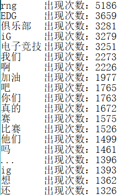

# weibo-topic-spyder
微博超级话题爬虫，微博词频统计+情感分析+简单分类

### 超级话题爬虫

使用了selenium模拟浏览器登陆进行爬取，具体话题爬取数量受微博限制，目前单个话题最大获取微博数量为8000条左右，爬取完毕后存储在xls中

账号与IP数量对单个超话的爬取帮助不大，就只设置了单账号和ip模式，若需多超话同时爬取可以自行添加。

### 词频统计
使用了jieba库进行分词，最后对分词结果进行统计并且存储到txt中

### 情感分析
调用了百度大脑的api接口，因为这个平台不限调用次数

爬取数据展示

词频统计展示

